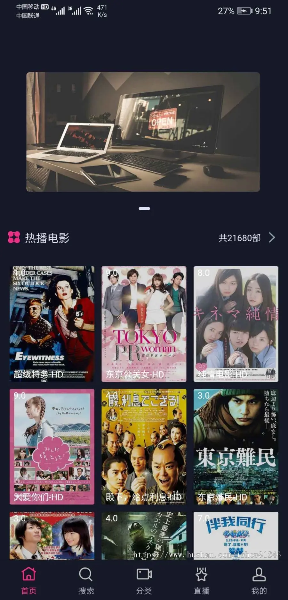
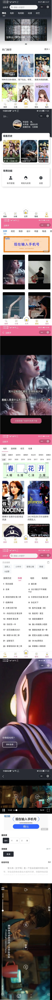

## 云影评视频小程序（原617kan）

技术栈：vue/php

后端：hisiphp框架

该项目本来只是一个学习uniapp时练手的小东西，因为有了大家的支持功能才一步步完善，曾经二手倒卖泛滥成灾，本着对正版用户负责到底的态度，一直更新到了现在的2.0炫彩版，现全开源此1.0老版本，供大家学习使用（其实也没啥可学的，老版本代码写的比较乱）。

该开源源码没有什么大问题，可能有小部分地方有bug需要调整，若实在搞不定可提交issues。

>   www     为后端api系统
>
>   uniapp  为前端uniapp项目

## 云影评2.0炫彩版

新版本在老版本原有的功能上，重构了前后端所有代码，重构了UI界面，新增了自助领取兑换码激活会员、通讯接口加密、后台自助升级等，下附更新日志，感兴趣的联系QQ：723875993咨询详情。

>   主要功能介绍:
>
>   1、增加了观看激励广告下载壁纸功能（可设置是否强制观看广告下载）。
>   2、后台可动态配置底部菜单是否显示、菜单图标自由更换，跳转链接可导向本小程序和外部小程序。
>   3、支持解析，告别卡顿！同时支持解析模式和普通直链模式。
>   4、后台在线更新系统，告别升级包手动覆盖， 解决升级难的问题。
>   5、加入I18N语言包，轻松修改语言，受众面更广。
>   6、支持小程序、打包双端APP。
>   7、版本控制系统，可远程控制域名授权、认证、升级包发布、用户管理等实用功能；版本控制系统允许一个用户注册多个域名（站点）。
>   
>
>   
>
>   炫彩版更新日志：
>
>   **2.0.1版本更新说明：**
>
>   **1、新增用户自助领取兑换码功能，同时兑换码可裂变，用户分享页面可自动升级会员组。**
>
>   2.0.0版本更新说明及优惠：
>
>   1、打包双端APP现已初步完成，目前可打安卓及IOS双端APP包，支持投屏；
>
>   2、针对小程序流量主及引流相关内容，更新优化了一些引导弹窗或提示；
>
>   3、重构后端图片附件管理相关内容；
>
>   4、其余很多优化及bug修复。
>
>   
>
>   1.1.4版本新增：
>
>   1、优化新增卡密有效期控制，卡密一对一、卡密一对多，一对多卡密限次
>
>   2、新增用户行为分析
>
>   3、新增用户定向订阅消息推送，优化批量推送订阅消息逻辑
>
>   4、现可对用户反馈留言进行回复
>
>   5、新增自定义播放线路排序
>
>   6、新增卡密使用情况统计
>
>   8、更换搜索页
>
>   9、优化各接口数据查询语句（测试实时用户请求6000+，搜索、查询15W+数据，服务器配置248已无特别明显卡顿）
>
>   10、接口数据加密防抓包，保护接口安全
>
>   
>
>   2021-8-24新增功能：
>
>   1、新增小程序推送订阅消息，唤醒沉睡用户利器
>
>   2、新增后台自定义最多7个底部菜单，后台灵活控制
>
>   3、新增跳转到公众号文章，更加方便引导用户关注公众号
>
>   4、新增生成海报
>
>   5、新增联系客服（支持自定义上传微信二维码或者小程序官方客服）
>
>   6、优化小程序广告位，添加原生广告模版
>
>   7、新增后台自定义分享封面图、标题

## 云影评切片系统

云影评切片系统框架主要面向开发者，该系统采用三端（PC用户端、WEB用户端、总管理后台）接口化部署，端口通讯数据使用AES加密，防数据抓包，保障数据安全，针对各个会员组可单独设置上传接口，管理更加灵活，后台模块化的设计，让新增功能模块更方便。对接支付宝及微信各类型支付，配置简单易操作，工厂类设计让新增支付更简单，前台、后台使用Vue框架，数据双向绑定，搭配ElementUi框架让UI开发更轻松。

-   对于普通用户来说，无代码傻瓜式操作，让环境配置更简单，程序运行更稳定；
-   对于开发者来说，模块化的开发方式让实现业务逻辑变得更简单，内置会员模块、订单管理、支付工厂、新闻公告、API通讯密钥管理，可为开发者减少大量开发工作，避免重复造轮子。
-   开发者技术栈：Vue、PHP、易语言

>   使用文档：https://cut-doc.617kan.cn/
